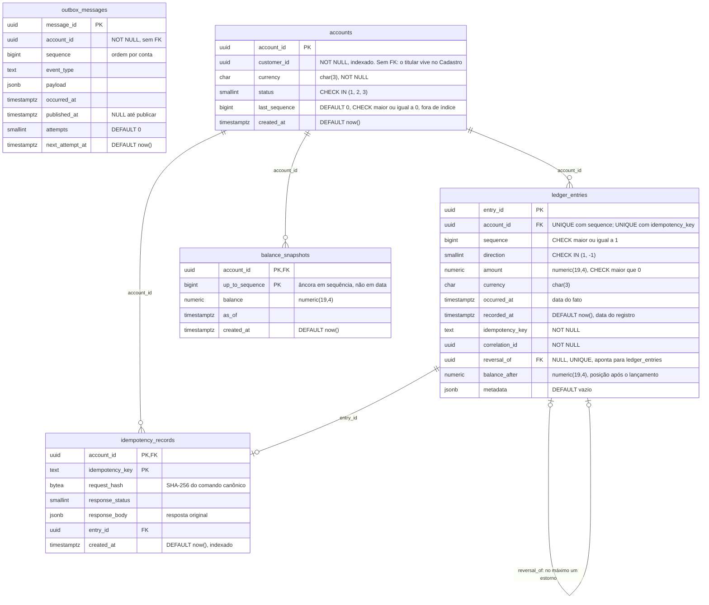

# Esquema do ledger: entidades e relacionamentos

As 5 tabelas do esquema `ledger`, transcritas de [`db/init/001_roles_and_schema.sql`](../../db/init/001_roles_and_schema.sql) coluna por coluna. O [C4](./README.md) descreve a arquitetura; este diagrama descreve onde os dados e as regras moram. Os dois se complementam.

**Por que este diagrama importa:** neste sistema, várias regras de negócio não estão no código, estão no banco. Lançamento positivo, sequência sem duplicata, um único estorno por lançamento e chave de idempotência única são constraints; a imutabilidade do ledger é ausência de privilégio. Ler o esquema é ler as invariantes.

## As quatro notas

### 1. Autorrelacionamento do estorno: no máximo um estorno por lançamento

`ledger_entries.reversal_of` aponta para outro `ledger_entries.entry_id`: o estorno é um lançamento novo que referencia o original, nunca uma alteração dele (RN-003, RN-004). Duas constraints fazem o trabalho:

- A FK garante que o original **existe**
- `uq_entries_reversal UNIQUE (reversal_of)` garante que **cada lançamento admite no máximo um estorno**. É garantia estrutural: dois estornos simultâneos do mesmo lançamento não passam, qualquer que seja o código. Medido em `ReversalTests`, com 10 estornos simultâneos e exatamente um aceito

O que a FK **não** garante, e por isso fica com o agregado (`Account.Reverse`): que o original pertence à mesma conta, que não é ele próprio um estorno, e que sentido e valor são os opostos. A FK é sobre existência; a regra de negócio é sobre significado.

### 2. Snapshot ancorado em sequência, não em data

A chave primária de `balance_snapshots` é composta por `(account_id, up_to_sequence)`: o snapshot diz "a posição depois do lançamento de sequência N", não "a posição no dia D". A posição corrente é o snapshot mais recente somado aos lançamentos de sequência maior ([ADR-0007](../adr/ADR-0007-snapshot-e-projecao.md)).

**Consequência:** a consulta histórica (`?asOf=`) não usa snapshot. Sequência é ordem de registro; `occurred_at` é ordem do fato. Com lançamento retroativo, as duas ordens divergem, e um snapshot "até a sequência N" pode conter um fato posterior ao instante pedido. A consulta histórica agrega `ledger_entries` pelo índice `ix_entries_account_occurred`, que cobre as colunas do cálculo. É limitação assumida e declarada no ADR-0007.

### 3. `outbox_messages` não tem chave estrangeira

**Fato do esquema:** `outbox_messages.account_id` é `NOT NULL` e não referencia `accounts`; nenhuma coluna da outbox referencia `ledger_entries`. A relação com o lançamento existe só nos dados: `(account_id, sequence)` identifica o lançamento, e `payload` carrega a cópia do evento.

**Decisão não registrada.** O [ADR-0008](../adr/ADR-0008-outbox-transacional.md) define a tabela sem FK, mas não diz por quê, e o script de esquema também não. Justificativas plausíveis, `[INFERIDO]` e não verificadas como intenção original: a mensagem é cópia autossuficiente do evento, não referência a ele; e a outbox precisa de expurgo das mensagens publicadas (ADR-0008, consequências), que fica mais simples sem vínculo de integridade com o ledger. A ausência pode ser lida como defeito por quem não conhece o padrão. Registrada como lacuna **L-12** no [ESTADO](../ESTADO.md) §6, para decisão explícita no ADR-0008.

### 4. Duas barreiras de idempotência, não duplicação

A unicidade da chave de idempotência aparece duas vezes, e não é redundância: são controles em níveis diferentes ([ADR-0006](../adr/ADR-0006-idempotencia.md)).

| Onde | O que guarda | Para que serve |
|---|---|---|
| `idempotency_records`, PK `(account_id, idempotency_key)` | A impressão do comando (`request_hash`) e a resposta original | Responder o reenvio: impressão igual devolve o original, diferente devolve `409`. É lida sob o bloqueio da conta, antes do agregado decidir (revisão do ADR-0006) |
| `ledger_entries`, `uq_entries_idempotency UNIQUE (account_id, idempotency_key)` | Nada além da chave | Barreira independente no próprio ledger: mesmo que algum caminho grave o lançamento sem passar pelo registro, a mesma chave não gera dois lançamentos |

O registro pode ser expurgado no futuro (ADR-0006 prevê 90 dias); a constraint no ledger, não, porque o ledger é append-only.

## Índices

| Índice | Tabela | Colunas | Para quê |
|---|---|---|---|
| `ix_accounts_customer` | `accounts` | `customer_id` | Contas de um titular |
| `ix_entries_account_occurred` | `ledger_entries` | `(account_id, occurred_at, sequence)` `INCLUDE (direction, amount)` | Consulta histórica sem acessar a tabela (RNF-003) |
| `ix_idempotency_created` | `idempotency_records` | `created_at` | Expurgo por idade |
| `ix_outbox_pending` | `outbox_messages` | `next_attempt_at` `WHERE published_at IS NULL` | Varredura proporcional à fila, não ao histórico |

As constraints `UNIQUE` também criam índices; `uq_entries_sequence` é o que atende o extrato paginado por cursor.

## Privilégios do papel da aplicação

A imutabilidade do ledger não está desenhada acima porque não é estrutura: é ausência de privilégio ([ADR-0009](../adr/ADR-0009-seguranca-e-privilegio-minimo.md)).

| Tabela | `pacioli_runtime` pode | Não pode |
|---|---|---|
| `ledger_entries` | `SELECT`, `INSERT` | `UPDATE`, `DELETE` |
| `balance_snapshots` | `SELECT`, `INSERT` | `UPDATE`, `DELETE` |
| `idempotency_records` | `SELECT`, `INSERT` | `UPDATE`, `DELETE` |
| `outbox_messages` | `SELECT`, `INSERT`, `UPDATE` | `DELETE` |
| `accounts` | `SELECT`, e `UPDATE` só na coluna `last_sequence` | Alterar status, moeda ou titular |

`pacioli_readonly` tem só `SELECT`. `pacioli_migrator` é dono do esquema e não é usado pela aplicação em execução.

## Conferência contra o script

Conferido em 2026-10-02 contra `db/init/001_roles_and_schema.sql`, linha por linha, e contra o catálogo do PostgreSQL com o script aplicado (`information_schema.columns` e `pg_constraint`), por comparação automática de nome, tipo e ordem de cada coluna:

| Item do script | No diagrama |
|---|---|
| 5 tabelas do esquema `ledger` | 5 entidades |
| 40 colunas (6 + 13 + 5 + 7 + 9) | 40 atributos, mesmo nome, mesmo tipo, mesma ordem |
| 5 PK: `account_id`; `entry_id`; `pk_balance_snapshots (account_id, up_to_sequence)`; `pk_idempotency (account_id, idempotency_key)`; `message_id` | 5 chaves primárias, duas compostas |
| 5 FK: `ledger_entries.account_id`, `ledger_entries.reversal_of`, `balance_snapshots.account_id`, `idempotency_records.account_id`, `idempotency_records.entry_id` | 5 relacionamentos |
| 3 UNIQUE: `uq_entries_sequence`, `uq_entries_idempotency`, `uq_entries_reversal` | Nos atributos de `ledger_entries` |
| 5 CHECK: `ck_accounts_status`, `ck_accounts_sequence`, `ck_entries_amount`, `ck_entries_direction`, `ck_entries_sequence` | Nos atributos |
| 4 índices explícitos | Tabela de índices |
| `GRANT`s dos 3 papéis | Tabela de privilégios |

`accounts` é criada com `fillfactor = 70`, para que a atualização de `last_sequence` caiba na mesma página (atualização HOT, ADR-0005). Atributo físico, sem representação em diagrama de entidades.
