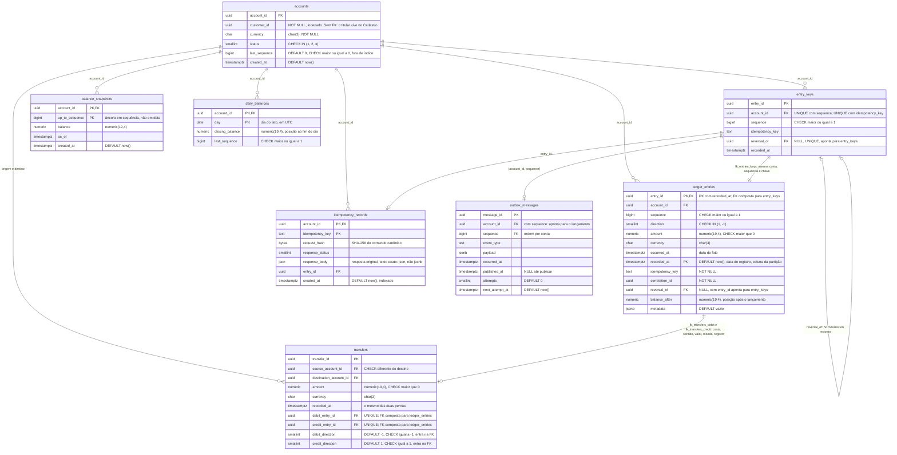

# Esquema do ledger: entidades e relacionamentos

As 8 tabelas do esquema `ledger`, transcritas das migrações [`0001_esquema_inicial.sql`](../../db/migrations/0001_esquema_inicial.sql), [`0002_saldo_diario.sql`](../../db/migrations/0002_saldo_diario.sql), [`0003_particionamento_do_ledger.sql`](../../db/migrations/0003_particionamento_do_ledger.sql) e [`0004_transferencias.sql`](../../db/migrations/0004_transferencias.sql) coluna por coluna. `ledger_entries` é particionada por mês de `recorded_at` ([ADR-0013](../adr/ADR-0013-particionamento-do-ledger.md)); as partições são detalhe físico e não aparecem como entidades. Migração nova que altere tabela deste diagrama atualiza o diagrama no mesmo commit. O [C4](./README.md) descreve a arquitetura; este diagrama descreve onde os dados e as regras moram. Os dois se complementam.

**Por que este diagrama importa:** neste sistema, várias regras de negócio não estão no código, estão no banco. Lançamento positivo, sequência sem duplicata, um único estorno por lançamento e chave de idempotência única são constraints; a imutabilidade do ledger é ausência de privilégio. Ler o esquema é ler as invariantes.

## As notas

### 1. Autorrelacionamento do estorno: no máximo um estorno por lançamento

`ledger_entries.reversal_of` aponta para outro `ledger_entries.entry_id`: o estorno é um lançamento novo que referencia o original, nunca uma alteração dele (RN-003, RN-004). Duas constraints fazem o trabalho:

- A FK garante que o original **existe**
- `uq_entries_reversal UNIQUE (reversal_of)` garante que **cada lançamento admite no máximo um estorno**. É garantia estrutural: dois estornos simultâneos do mesmo lançamento não passam, qualquer que seja o código. Medido em `ReversalTests`, com 10 estornos simultâneos e exatamente um aceito

O que a FK **não** garante, e por isso fica com o agregado (`Account.Reverse`): que o original pertence à mesma conta, que não é ele próprio um estorno, e que sentido e valor são os opostos. A FK é sobre existência; a regra de negócio é sobre significado.

### 2. Snapshot ancorado em sequência, não em data

A chave primária de `balance_snapshots` é composta por `(account_id, up_to_sequence)`: o snapshot diz "a posição depois do lançamento de sequência N", não "a posição no dia D". A posição corrente é o snapshot mais recente somado aos lançamentos de sequência maior ([ADR-0007](../adr/ADR-0007-snapshot-e-projecao.md)).

**Consequência:** a consulta histórica (`?asOf=`) não usa snapshot. Sequência é ordem de registro; `occurred_at` é ordem do fato. Com lançamento retroativo, as duas ordens divergem, e um snapshot "até a sequência N" pode conter um fato posterior ao instante pedido.

**Desde o card 32**, a consulta histórica parte de `daily_balances`, que é ancorado na **data do fato**: fechamento do último dia anterior mais os lançamentos do próprio dia até o instante, estes pelo índice `ix_entries_account_occurred`. Lançamento retroativo corrige os fechamentos dos dias seguintes na mesma transação ([ADR-0007](../adr/ADR-0007-snapshot-e-projecao.md), revisão).

### 3. Toda mensagem da outbox aponta para um lançamento

`outbox_messages` referencia `ledger_entries` pela chave composta `fk_outbox_entry (account_id, sequence)`. O par já identifica o lançamento e já é único no ledger (`uq_entries_sequence`), então a chave garante que o lançamento existe e, por ele, que a conta existe. Mensagem sem lançamento correspondente, o "evento fantasma" que o [ADR-0008](../adr/ADR-0008-outbox-transacional.md) existe para eliminar, é recusada pelo banco, e não só evitada pelo código.

**Histórico:** até 2026-10-02 a tabela não tinha chave estrangeira, e nenhum documento dizia por quê (lacuna L-12). A chave foi acrescentada por decisão registrada no ADR-0008, que também registra as alternativas rejeitadas: chave simples para `accounts`, que aceitaria mensagem de lançamento inexistente, e coluna `entry_id`, que duplicaria uma identificação existente.

Sem índice próprio do lado da outbox: o ledger é append-only, então a chave nunca é verificada por exclusão ou alteração do lado referenciado.

### 4. Duas barreiras de idempotência, não duplicação

A unicidade da chave de idempotência aparece duas vezes, e não é redundância: são controles em níveis diferentes ([ADR-0006](../adr/ADR-0006-idempotencia.md)).

| Onde | O que guarda | Para que serve |
|---|---|---|
| `idempotency_records`, PK `(account_id, idempotency_key)` | A impressão do comando (`request_hash`) e a resposta original | Responder o reenvio: impressão igual devolve o original, diferente devolve `409`. É lida sob o bloqueio da conta, antes do agregado decidir (revisão do ADR-0006) |
| `ledger_entries`, `uq_entries_idempotency UNIQUE (account_id, idempotency_key)` | Nada além da chave | Barreira independente no próprio ledger: mesmo que algum caminho grave o lançamento sem passar pelo registro, a mesma chave não gera dois lançamentos |

O registro pode ser expurgado no futuro (ADR-0006 prevê 90 dias); a constraint no ledger, não, porque o ledger é append-only.

### 5. Ledger particionado, chaves num registro não particionado (card 37)

No PostgreSQL, restrição única de tabela particionada só vale dentro de cada partição. Para não perder as quatro garantias (identidade, sequência, idempotência, estorno único), elas vivem em `entry_keys`, que não é particionada, com os mesmos nomes de antes. Cada linha do ledger é amarrada à sua chave por `fk_entries_keys (entry_id, account_id, sequence, idempotency_key)`; o estorno, por `fk_entries_reversal (entry_id, reversal_of)`. Outbox e idempotência apontam para `entry_keys`. Por isso as notas 1, 3 e 4 acima valem como antes: a regra é a mesma, o lugar da restrição mudou ([ADR-0013](../adr/ADR-0013-particionamento-do-ledger.md)).

### 6. Transferência: as duas pernas amarradas pelo banco (card 38)

A transferência são dois lançamentos comuns, um débito na origem e um crédito no destino, gravados na mesma transação ([ADR-0014](../adr/ADR-0014-transferencia-entre-contas.md)). `transfers` aponta para os dois por chaves estrangeiras compostas: `fk_transfers_debit (debit_entry_id, recorded_at, source_account_id, debit_direction, amount, currency)` só aceita um **débito da origem**, e `fk_transfers_credit` só um **crédito do destino**, os dois pelo valor, na moeda e no instante de registro da transferência. As colunas de sentido são constantes fixadas por `CHECK`: existem porque a chave estrangeira não aceita literal. O alvo das duas chaves é `uq_entries_leg UNIQUE (entry_id, recorded_at, account_id, direction, amount, currency)` no ledger, que inclui `recorded_at` porque o ledger é particionado. `uq_transfers_debit` e `uq_transfers_credit` impedem que uma perna sirva a duas transferências; `ck_transfers_distinct_accounts` recusa origem igual ao destino.

O que o banco **não** garante, e fica com a transação: que as duas pernas existam juntas. Um débito sem transferência é um débito comum; o que impede o débito de uma transferência sem o crédito é a transação única, verificada com falha provocada na gravação da perna de crédito.

## Índices

| Índice | Tabela | Colunas | Para quê |
|---|---|---|---|
| `ix_accounts_customer` | `accounts` | `customer_id` | Contas de um titular |
| `ix_entries_account_occurred` | `ledger_entries`, em cada partição | `(account_id, occurred_at, sequence)` `INCLUDE (direction, amount)` | Lançamentos do dia na consulta histórica (RNF-003) |
| `ix_entries_account_sequence` | `ledger_entries`, em cada partição | `(account_id, sequence)` | Extrato e posição corrente por sequência; antes atendidos pelo índice de `uq_entries_sequence`, que foi para `entry_keys` (card 37) |
| `ix_idempotency_created` | `idempotency_records` | `created_at` | Expurgo por idade |
| `ix_transfers_source`, `ix_transfers_destination` | `transfers` | `source_account_id`; `destination_account_id` | Transferências de uma conta, nos dois sentidos |
| `ix_outbox_pending` | `outbox_messages` | `next_attempt_at` `WHERE published_at IS NULL` | Varredura proporcional à fila, não ao histórico |

As constraints `UNIQUE` também criam índices, em `entry_keys`; `uq_entries_reversal` é o que atende a verificação de estorno existente. `uq_entries_leg` cria um índice em cada partição do ledger, só para servir de alvo às chaves de `transfers` (custo registrado no ADR-0014).

## Privilégios do papel da aplicação

A imutabilidade do ledger não está desenhada acima porque não é estrutura: é ausência de privilégio ([ADR-0009](../adr/ADR-0009-seguranca-e-privilegio-minimo.md)).

| Tabela | `pacioli_runtime` pode | Não pode |
|---|---|---|
| `ledger_entries` | `SELECT`, `INSERT` | `UPDATE`, `DELETE` |
| `entry_keys` | `SELECT`, `INSERT` | `UPDATE`, `DELETE` |
| `transfers` | `SELECT`, `INSERT` | `UPDATE`, `DELETE` |
| `balance_snapshots` | `SELECT`, `INSERT` | `UPDATE`, `DELETE` |
| `daily_balances` | `SELECT`, `INSERT`, `UPDATE` (corrigir os dias seguintes a um retroativo) | `DELETE` |
| `idempotency_records` | `SELECT`, `INSERT` | `UPDATE`, `DELETE` |
| `outbox_messages` | `SELECT`, `INSERT`, `UPDATE` | `DELETE` |
| `accounts` | `SELECT`, e `UPDATE` só na coluna `last_sequence` | Alterar status, moeda ou titular |

`pacioli_readonly` tem só `SELECT`. `pacioli_migrator` é dono do esquema e não é usado pela aplicação em execução.

## Conferência contra o script

Conferido em 2026-10-02 contra `db/init/001_roles_and_schema.sql` (movido sem alteração de esquema para `db/migrations/0001_esquema_inicial.sql` no card 27), linha por linha, e contra o catálogo do PostgreSQL com o script aplicado (`information_schema.columns` e `pg_constraint`), por comparação automática de nome, tipo e ordem de cada coluna:

**Reconferido em 2026-10-05, com a migração 0004 (card 38)**, contra o catálogo do PostgreSQL, sem contar as partições: 8 tabelas, 60 colunas (10 de `transfers`), 8 PK, 14 FK (4 novas, de `transfers`), 8 UNIQUE (`uq_entries_leg`, `uq_transfers_debit`, `uq_transfers_credit` novas), 11 CHECK (4 novos, de `transfers`).

**Reconferido em 2026-10-05, com a migração 0003 (card 37)**, contra o catálogo do PostgreSQL, sem contar as partições: 7 tabelas, 50 colunas (6 de `entry_keys`), 7 PK, 10 FK (as quatro que apontavam para o ledger agora apontam para `entry_keys`), 5 UNIQUE (as 3 das regras, em `entry_keys`, e as 2 que servem de alvo às chaves compostas), 7 CHECK.

**Reconferido em 2026-10-05, com a migração 0002 (card 32)**, contra o catálogo do PostgreSQL: 6 tabelas, 44 colunas (as 40 da conferência original abaixo mais 4 de `daily_balances`), 6 PK, 7 FK, 3 UNIQUE, 6 CHECK (mais `ck_daily_last_sequence`); privilégios de `daily_balances` conforme a tabela de privilégios.

Conferência original, de 2026-10-02:

| Item do script | No diagrama |
|---|---|
| 5 tabelas do esquema `ledger` | 5 entidades |
| 40 colunas (6 + 13 + 5 + 7 + 9) | 40 atributos, mesmo nome, mesmo tipo, mesma ordem |
| 5 PK: `account_id`; `entry_id`; `pk_balance_snapshots (account_id, up_to_sequence)`; `pk_idempotency (account_id, idempotency_key)`; `message_id` | 5 chaves primárias, duas compostas |
| 6 FK: `ledger_entries.account_id`, `ledger_entries.reversal_of`, `balance_snapshots.account_id`, `idempotency_records.account_id`, `idempotency_records.entry_id`, `fk_outbox_entry (account_id, sequence)` | 6 relacionamentos |
| 3 UNIQUE: `uq_entries_sequence`, `uq_entries_idempotency`, `uq_entries_reversal` | Nos atributos de `ledger_entries` |
| 5 CHECK: `ck_accounts_status`, `ck_accounts_sequence`, `ck_entries_amount`, `ck_entries_direction`, `ck_entries_sequence` | Nos atributos |
| 4 índices explícitos | Tabela de índices |
| `GRANT`s dos 3 papéis | Tabela de privilégios |

`accounts` é criada com `fillfactor = 70`, para que a atualização de `last_sequence` caiba na mesma página (atualização HOT, ADR-0005). Atributo físico, sem representação em diagrama de entidades.
