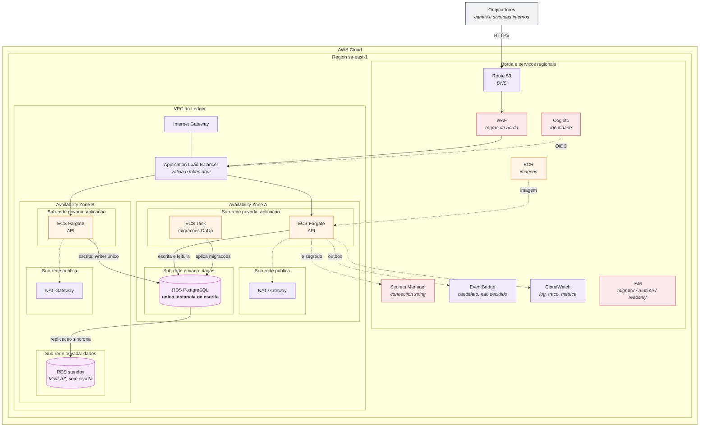

# Arquitetura-alvo na AWS

> **Este diagrama é proposta de implantação, não o estado atual.**
> O sistema entregue roda em `docker compose` (ver [README](../../README.md)) e **não foi implantado na AWS**. Nenhum recurso descrito aqui existe. A tabela de estado da §2 declara isso elemento por elemento.
>
> O desenho equivalente com os ícones oficiais AWS está no Lucid, para apresentação. Este arquivo é a versão que vive no repositório, versionável e diffável.

---

## 1. O diagrama

---

## 2. Estado de cada elemento

Nenhum elemento está implantado. O que varia é se o **comportamento** que ele representa já existe no sistema entregue.

| Elemento | Estado do comportamento no sistema entregue |
|---|---|
| ECS Fargate: API | **Implementado** como contêiner Docker; roda hoje em `pacioli-api` |
| ECS Task: migrações | **Implementado** como passo separado do compose (`pacioli-migrations`), com o papel `migrator` |
| RDS PostgreSQL (escrita) | **Implementado** como PostgreSQL 17 em contêiner, com os três papéis e o bloqueio por conta |
| RDS standby Multi-AZ | **Especificado, não existe.** O ambiente local tem uma instância só |
| ALB + Cognito | **Especificado, não existe.** O ADR-0009 define a borda; a API hoje não autentica |
| WAF, Route 53, IGW, NAT | **Especificado, não existe.** Não há equivalente local |
| Secrets Manager | **Parcial.** A connection string já vem de variável de ambiente, fora da imagem e do código |
| EventBridge | **Candidato, não decidido** (ADR-0008). A outbox grava; o despachante publica em log |
| CloudWatch | **Parcial.** Log JSON mascarado, traços e métricas por OTLP já existem (ADR-0012); o destino local é o painel do Aspire |
| IAM | **Parcial.** Os três papéis existem no banco; os papéis de IAM não |
| ECR | **Especificado, não existe.** A imagem é construída localmente |

---

## 3. As quatro decisões que o desenho preserva

Um diagrama de nuvem que só distribui ícones não comunica arquitetura. Estes quatro pontos são o conteúdo:

### 3.1 Uma única instância de escrita

O bloqueio pessimista da linha da conta ([ADR-0005](../adr/ADR-0005-controle-de-concorrencia.md)) **exige** um só writer: é dele que vem a serialização por conta. A seta da AZ B atravessa para o RDS da AZ A de propósito, para que o desenho não sugira dois bancos independentes.

**O standby Multi-AZ é disponibilidade, não escala de escrita.** É o erro de leitura mais comum num diagrama Multi-AZ. Escala de leitura seria read replica, e está fora deste desenho porque a consulta de posição é servida pela própria instância primária no volume previsto.

### 3.2 Migrações em task própria, com papel próprio

`ECS Task: migrações` roda com `migrator`, aplica o que falta e **termina**. A API roda com `runtime`, que não tem privilégio de alterar esquema ([ADR-0002](../adr/ADR-0002-plataforma-e-armazenamento.md), revisão do card 27). É a mesma separação do compose local, traduzida.

### 3.3 Autenticação na borda, fora do serviço

O token é validado no ALB, **antes** de a requisição alcançar o Fargate ([ADR-0009](../adr/ADR-0009-seguranca-e-privilegio-minimo.md)). O Ledger não autentica, e o diagrama mostra onde isso acontece em vez de deixar a lacuna implícita.

**API Gateway foi rejeitado:** seria camada extra na frente de um balanceador que já valida OIDC nativamente. Volta a valer com limite de taxa por consumidor, chaves de API ou monetização.

### 3.4 Barramento de eventos não escolhido

EventBridge aparece com linha tracejada e rótulo de candidato. O [ADR-0008](../adr/ADR-0008-outbox-transacional.md) decidiu o **padrão outbox**, não o produto: a decisão arquitetural é que o evento é gravado na transação do lançamento, e o despachante o publica depois. SNS, SQS e Kafka gerenciado atendem igual.

---

## 4. Escolha de compute, e a alternativa rejeitada

**ECS Fargate**, não EKS: o sistema é um monolito modular que entrega uma imagem Docker. Kubernetes acrescentaria plano de controle, nós e operação para resolver um problema de escala organizacional que não existe aqui. Volta a valer com vários times implantando serviços distintos no mesmo cluster.

**Fargate, não EC2:** não há carga de longa duração nem necessidade de controle de instância que justifique gerenciar nós.

---

## 5. O que este desenho não resolve

| Ponto | Situação |
|---|---|
| Contenção dentro da mesma conta | Não eliminada. É o preço da consistência forte. A mitigação nomeada (fila por conta quente, risco R-01) não está no desenho |
| Custo | Não estimado. Multi-AZ no RDS dobra o custo de banco |
| Região única | Sem plano de recuperação entre regiões. Falha de região derruba o serviço |
| Expurgo da outbox | A tabela cresce sem limite (ADR-0008, consequências) |

Declarar isto faz parte do desenho. Diagrama sem limite declarado é propaganda.

---

## 6. Versão para apresentação

O equivalente com os ícones oficiais AWS 2024 está no Lucid, na pasta de diagramas do projeto. Os dois dizem a mesma coisa; este é o que acompanha o código.
