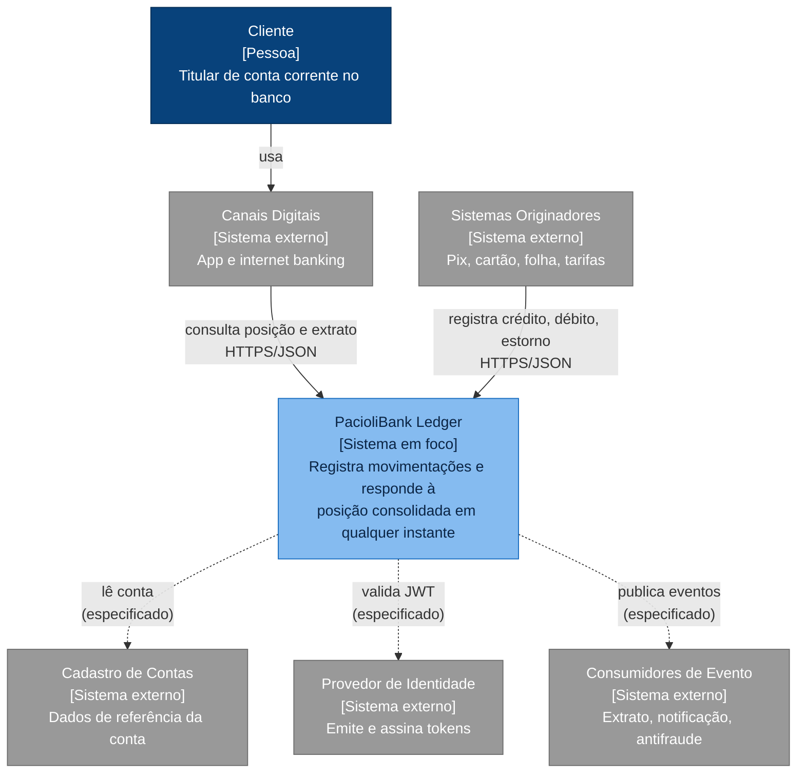

# C1: Contexto

O PacioliBank Ledger no seu entorno: quem o usa e com quais sistemas ele conversa. Convenções em [README](./README.md).

## Estado de cada elemento

| Elemento | Estado | Evidência |
|---|---|---|
| PacioliBank Ledger | **Parcial** | Os 5 endpoints da EF §8.3 respondem; autenticação, autorização e publicação de eventos não existem |
| Canais Digitais → Ledger (consulta) | Implementado | `GET /balance` e `GET /entries` em `Endpoints/LedgerEndpoints.cs` |
| Originadores → Ledger (registro) | Implementado | `POST /credits`, `/debits`, `/entries/{id}/reversals` |
| Ledger → Cadastro de Contas | Especificado | Hoje a tabela `ledger.accounts` é preenchida por massa local (`db/init/002_seed_local.sql`); a replicação do Cadastro não existe |
| Ledger → Provedor de Identidade | Especificado | Nenhuma validação de token. Qualquer chamador opera qualquer conta (ESTADO §5, RF-009) |
| Ledger → Consumidores de Evento | Especificado | O evento é **gravado** na outbox, na mesma transação do lançamento (ADR-0008); nada o **publica** (card 24) |

## Fronteira que o diagrama fixa

O ciclo de vida da conta pertence ao Cadastro, não ao Ledger. O privilégio no banco reflete isso: o papel da aplicação só pode alterar `last_sequence` em `ledger.accounts` (ADR-0009, EF §3.2).
