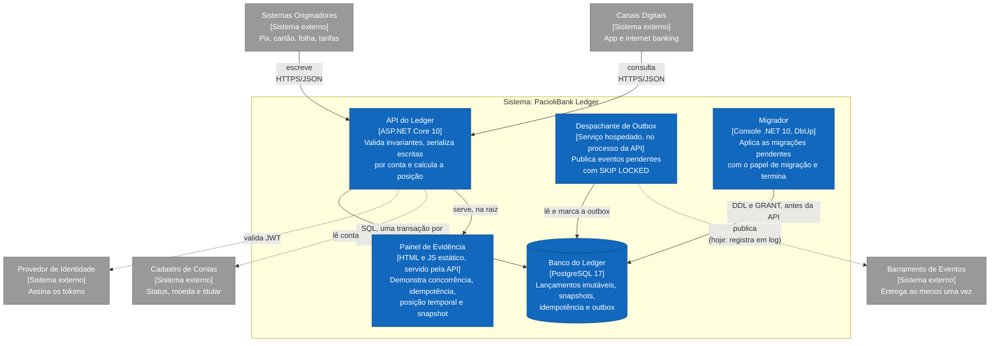

# C2: Contêineres

Processos e armazenamentos que compõem o sistema. Convenções em [README](./README.md).

## Estado de cada elemento

| Elemento | Estado | Evidência |
|---|---|---|
| API do Ledger | Implementado, sem autenticação | `src/PacioliBank.Api`; `docker compose up --build` serve em `:8080` |
| Banco do Ledger | Implementado | `db/migrations/` (0001 e 0002): 6 tabelas, 3 papéis, constraints por regra |
| Migrador | Implementado | Card 27: `src/PacioliBank.Migrations`, serviço `pacioli-migrations` do `docker compose`. Único processo com a credencial de migração; a API só sobe depois que ele termina com sucesso (ADR-0002, revisão; ADR-0009) |
| Escrita na outbox | Implementado | `PostgresLedgerStore.WriteAsync`, na transação do lançamento (ADR-0008) |
| Despachante de Outbox | Implementado | Card 24: `PacioliBank.Events/OutboxDispatcher.cs`, executado por `OutboxDispatcherService` no processo da API. Rodar no mesmo processo é decisão operacional (ADR-0008); várias instâncias convivem pelo `SKIP LOCKED` |
| Despachante → Barramento | Especificado | O publicador atual registra o evento em log (`LoggingEventPublisher`), como o ADR-0008 prevê enquanto a plataforma de mensageria não é conhecida |
| Painel de Evidência | Implementado | Card 25: `src/PacioliBank.Api/wwwroot/`, quatro demonstrações que usam só a API pública. Sem teste automatizado próprio, por decisão do ADR-0011; verificado em Chrome headless |
| API → Provedor de Identidade | Especificado | RF-009 pendente |
| API → Cadastro de Contas | Especificado | Contas vêm de massa local |
| Barramento de Eventos | Externo, não escolhido | ADR-0008 decide o padrão, não o produto |

## Decisões que o diagrama torna visíveis

- **Um único armazenamento transacional.** Lançamento, sequência, idempotência e outbox na mesma transação local (EF CU-01, passo 8). Separar em contêineres distintos abriria janela de inconsistência em dado financeiro.
- **A publicação é assíncrona e fora do caminho crítico.** O lançamento não depende do barramento estar disponível (RF-011): o despachante publica depois, com entrega ao menos uma vez.
