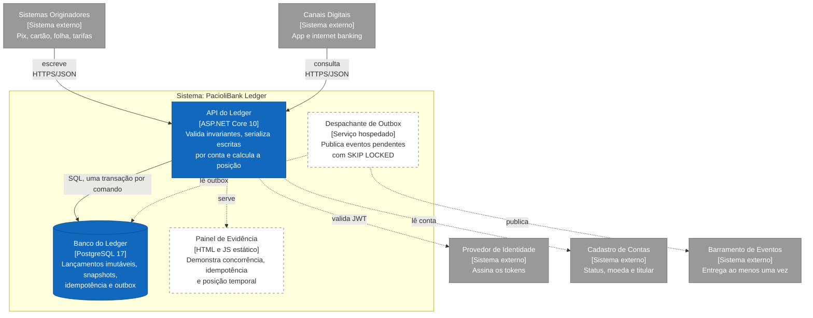

# C2: Contêineres

Processos e armazenamentos que compõem o sistema. Convenções em [README](./README.md).

## Estado de cada elemento

| Elemento | Estado | Evidência |
|---|---|---|
| API do Ledger | Implementado, sem autenticação | `src/PacioliBank.Api`; `docker compose up --build` serve em `:8080` |
| Banco do Ledger | Implementado | `db/init/001_roles_and_schema.sql`: 5 tabelas, 3 papéis, constraints por regra |
| Escrita na outbox | Implementado | `PostgresLedgerStore.WriteAsync`, na transação do lançamento (ADR-0008) |
| Despachante de Outbox | Especificado | Card 24. A tabela e o índice parcial `ix_outbox_pending` já existem |
| Painel de Evidência | Especificado, condicional | Card 25, ADR-0011, com critério de corte |
| API → Provedor de Identidade | Especificado | RF-009 pendente |
| API → Cadastro de Contas | Especificado | Contas vêm de massa local |
| Barramento de Eventos | Externo, não escolhido | ADR-0008 decide o padrão, não o produto |

## Decisões que o diagrama torna visíveis

- **Um único armazenamento transacional.** Lançamento, sequência, idempotência e outbox na mesma transação local (EF CU-01, passo 8). Separar em contêineres distintos abriria janela de inconsistência em dado financeiro.
- **A publicação é assíncrona e fora do caminho crítico.** O lançamento não depende do barramento estar disponível (RF-011): o despachante publica depois, com entrega ao menos uma vez.
