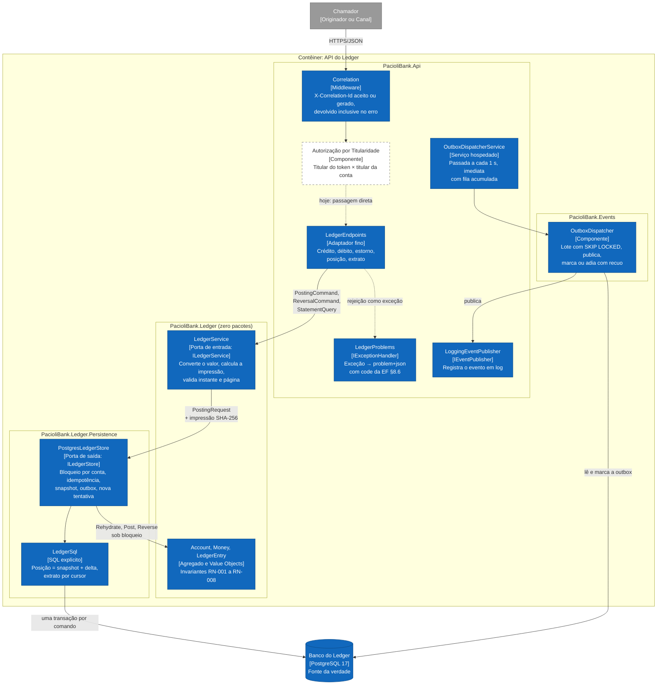

# C3: Componentes da API

Como a API se organiza por dentro, desenhada **a partir do código**. Convenções em [README](./README.md).

## Estado de cada componente

| Componente | Estado | Arquivo |
|---|---|---|
| Correlation | Implementado | `src/PacioliBank.Api/Endpoints/Correlation.cs` |
| Autorização por Titularidade | **Especificado** | Não existe. ADR-0009 define a regra: `404` para conta de terceiro, sem revelar existência |
| LedgerEndpoints | Implementado | `src/PacioliBank.Api/Endpoints/LedgerEndpoints.cs` |
| LedgerProblems | Implementado | `src/PacioliBank.Api/Endpoints/LedgerProblems.cs` |
| LedgerService | Implementado | `src/PacioliBank.Ledger/Application/LedgerService.cs` |
| Account, Money, LedgerEntry | Implementado | `src/PacioliBank.Ledger/Domain/` |
| PostgresLedgerStore | Implementado | `src/PacioliBank.Ledger.Persistence/PostgresLedgerStore.cs` |
| LedgerSql | Implementado | `src/PacioliBank.Ledger.Persistence/LedgerSql.cs` |
| OutboxDispatcher | Implementado | `src/PacioliBank.Events/OutboxDispatcher.cs` |
| OutboxDispatcherService | Implementado | `src/PacioliBank.Api/Events/OutboxDispatcherService.cs` |
| LoggingEventPublisher | Implementado, no lugar do barramento | `src/PacioliBank.Api/Events/LoggingEventPublisher.cs`. O barramento real não foi escolhido (ADR-0008) |

## A dependência aponta para dentro, e o compilador garante

`PacioliBank.Ledger` não declara nenhum `PackageReference`: referenciar Npgsql ou ASP.NET Core no domínio é erro de compilação, não violação de convenção. Os endpoints conhecem só a porta de entrada; só `Program.cs`, a raiz de composição, referencia a persistência (ADR-0001). O que o compilador não cobre, o NetArchTest cobre: as 5 regras de `PacioliBank.Architecture.Tests` (card 26) reprovam se o domínio depender da aplicação, se o Ledger depender de banco, HTTP ou de outro módulo, se o Events depender do Ledger, ou se os endpoints conhecerem o banco. A última regra achou uma violação real ao ser escrita: o tradutor de erros HTTP capturava a exceção do driver do banco; corrigido, e a falha de banco agora é traduzida pelo adaptador de dados.

## Correspondência com o C3 do Lucid

O Lucid desenhou oito componentes. O código organizou as mesmas responsabilidades de outra forma, e a tabela registra onde cada uma foi parar, para que a divergência seja explícita, e não silenciosa.

| Componente no Lucid | Onde vive no código | Por quê |
|---|---|---|
| Autorização por Titularidade | Não existe | RF-009 pendente |
| Endpoints de Lançamento | `LedgerEndpoints` | Um único adaptador para as 5 rotas |
| Endpoints de Consulta | `LedgerEndpoints` | Idem |
| Manipulador de Idempotência | Dividido: impressão em `LedgerService`, detecção em `PostgresLedgerStore` | A impressão é regra (ADR-0006) e fica na porta de entrada; a detecção é a violação de chave primária, que só existe dentro da transação |
| Domínio Ledger | `Account`, `Money`, `LedgerEntry` | Igual |
| Calculadora de Posição | Consulta `SelectCurrentBalance` em `LedgerSql` | Snapshot mais delta é uma única instrução SQL; como componente C#, traria as linhas para a memória |
| Repositório do Ledger | `PostgresLedgerStore` | Igual, com nome de porta orientada a caso de uso, não repositório genérico |
| Escritor de Outbox | `PostgresLedgerStore.WriteAsync` | Precisa da mesma conexão e transação do lançamento; separá-lo só acrescentaria um parâmetro de transação a repassar |
| (ausente no Lucid) | `LedgerService`, a porta de entrada | Criada no card 19 para fechar a lacuna L-03 |
| (ausente no Lucid) | `LedgerProblems`, `Correlation` | Mapeamento único de erro e rastreabilidade (EF §8.1, §8.6) |
