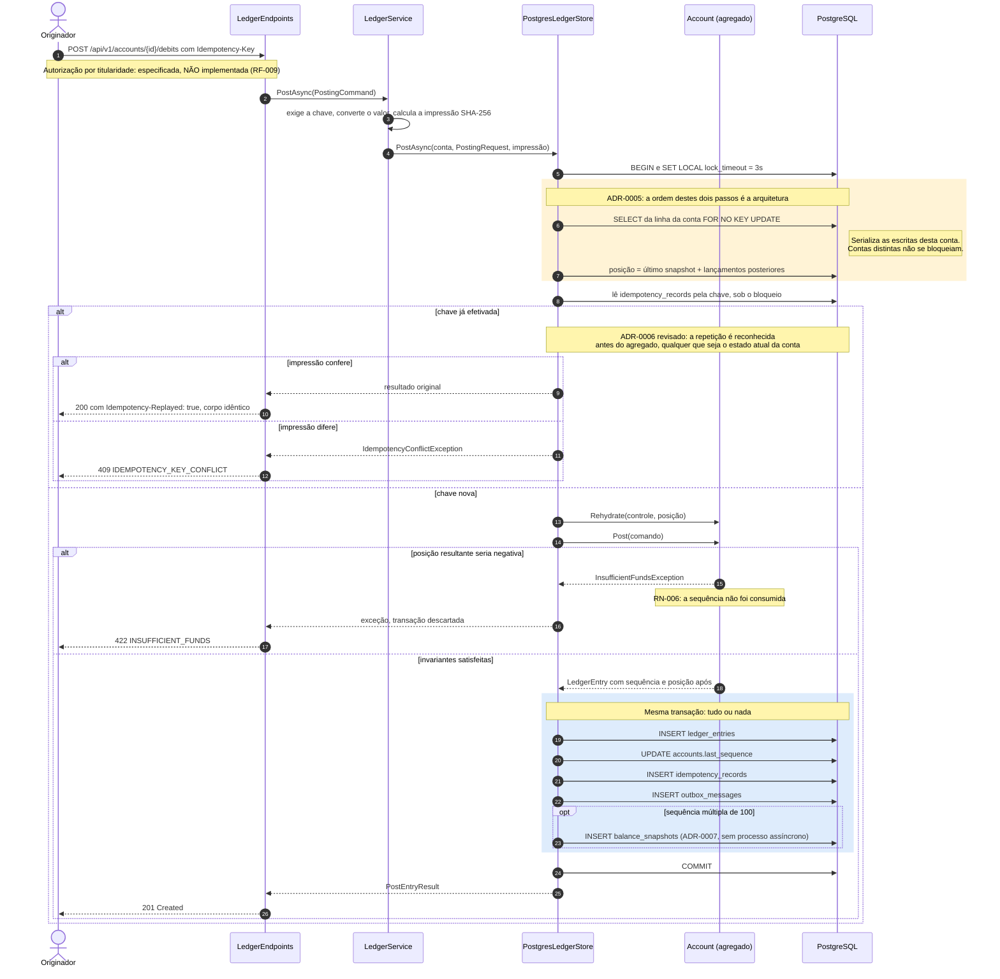

# C4: Registro de débito sob concorrência

Nível de código para o caminho mais crítico do sistema: um débito, do HTTP ao `COMMIT`. Desenhado **a partir de** `PostgresLedgerStore.PostOnceAsync`. Convenções em [README](./README.md).

## O que o diagrama fixa

| Passo | Decisão | Onde verificar |
|---|---|---|
| 6 e 7 | Bloquear **antes** de ler a posição. Inverter reabre a corrida que RN-001 proíbe | `LedgerSql.LockAccountForWrite`; teste F07 em `ConcurrencyTests` |
| 6 | `FOR NO KEY UPDATE`, não `FOR UPDATE`: não bloqueia leitura de chave estrangeira sobre a conta | ADR-0005 |
| 5 | `lock_timeout` de 3 s: sob contenção, rejeitar como repetível em vez de esgotar o pool | ADR-0005, RNF-014 |
| 8 a 12 | Repetição reconhecida **sob o bloqueio e antes do agregado**: o reenvio de um comando efetivado recebe o original mesmo que o saldo tenha caído ou a conta tenha sido bloqueada depois | ADR-0006, revisão de 2026-10-02 (L-10); testes `Reenvio_de_*` em `LedgerStoreTests` |
| 13 a 17 | Rejeição antes de qualquer gravação: a sequência não abre lacuna | RN-006; teste `Rejeicao_nao_consome_sequencia` |
| 19 a 23 | Lançamento, sequência, idempotência e outbox na mesma transação | EF CU-01, passo 8 |

**Fora do diagrama, mas no mesmo método:**

- **Segunda barreira.** Se a inserção em `idempotency_records` ainda violar a chave primária, a transação é desfeita e o registro é lido em nova conexão, com as mesmas respostas dos passos 9 a 12. Sob o bloqueio isso não acontece; a constraint existe para qualquer caminho futuro que grave sem ele.
- **Conflito de concorrência** (deadlock, `lock_timeout`, sequência duplicada) leva a até 3 tentativas com recuo exponencial; esgotadas, `503 SERVICE_UNAVAILABLE`, repetível com a mesma chave (RNF-004). Medido no ADR-0005: sem o bloqueio, a correção se mantém pela constraint, mas a maior parte dos comandos termina aqui.

## Estorno

O estorno segue o mesmo caminho, inclusive o reconhecimento da repetição, com um passo a mais: o lançamento original é lido sob o mesmo bloqueio, e quem decide titularidade, estorno de estorno, duplicidade e saldo, nessa ordem, é o agregado (`Account.Reverse`).
